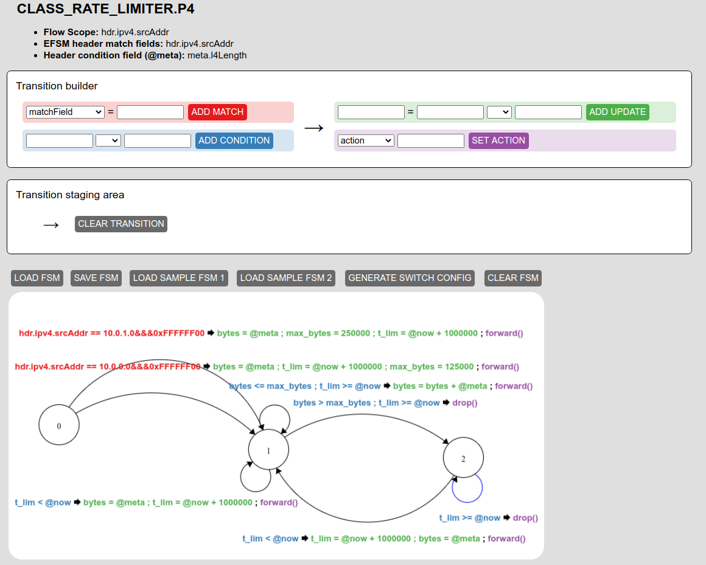

# TWO CLASS RATE LIMITER

This use case is an extension of the [Packet Limiter](/p4src/packet_limiter/docs/README.md)
## Run the GUI
Start the gui:
```bash
make start-gui
```
It will first compile the P4 program (the output is in `./p4build`) and then start the GUI.

Then click on **LOAD FSM** and load the file `EFSM_class_rate_limiter.json`. Then click on *GENERATE SWITCH CONFIG*, 
this will trigger the download of a switch configuration. Now, you can override the file `flowblaze_config.cli` 
with the just downloaded file (make sure to keep the same name).



## Run Mininet
Topology: 
```
h1--s1--h2
     |
    h10 <--iperf server
```

Start Mininet by running: 
```bash
make start-mn
```
Load the switch config:
```bash
make s1-load-config
```

Run the `iperf` test:
```bash
make h1-iperf-test-udp
make h2-iperf-test-udp
```

The bandwidth shown by `iperf` should be around 1Mbps for the first test and around 2Mbps for the second one.

You can start the switch log with: `make s1-log` and interact with the BMv2 Thrift CLI with `make s1-CLI`.

You can find more `make` target to interact with the dockerized Mininet in the `Makefile`.

## Teardown
```bash
make stop-gui
make stop-mn
```
