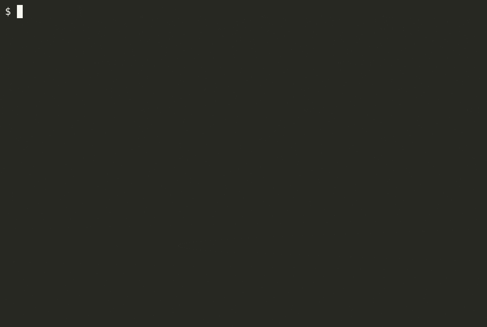

# PACKET LIMITER

## Run the GUI
Start the gui:
```bash
make start-gui
```
It will first compile the P4 program (the output is in `./p4build`) and then start the GUI.

Then click on **LOAD SAMPLE FSM 2**, and click on **GENERATE SWITCH CONFIG**. This will trigger the download of a switch configuration.
Now, you can override the file `flowblaze_config.cli` with the just downloaded file (make sure to keep the same name).

**TODO: add image of State Machine from GUI**

## Run Mininet
Topology: `h1 <--> s1 <--> h2`

Start Mininet by running: 
```bash
make start-mn
```
Load the switch config:
```bash
make s1-load-config
```

Run the `ping` test:
```bash
make h1-test
```
The ping should fail after 10 successful pings.



You can start the switch log with: `make s1-log` and interact with the BMv2 Thrift CLI with `make s1-CLI`.

You can find more `make` target to interact with the dockerized mininet in the `Makefile`.

## Teardown
```bash
make stop-gui
make stop-mn
```
